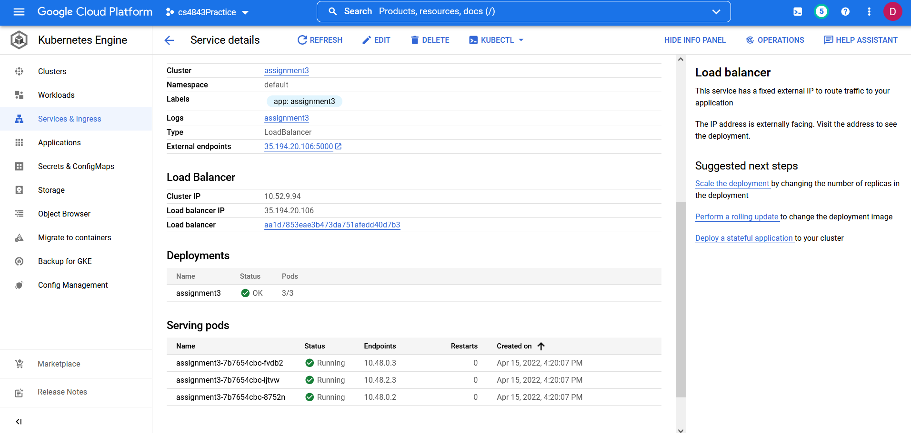

# CS4843AssignmentEC
## Description:
Deploy a python web application an a kubernetes cluster.
### Technologies Used:
- Google Cloud Platform(GCP): Used to deploy the kubernetes cluster
- python: Used to write a web application with flask.
- Docker: Used to create a docker image.

### Deployment Steps:
- 1.) Use gcloud to build the container image and push it to the Google Cloud Registry. Command: gcloud builds submit --tag gcr.io/Your Project Name/assignment3 .
- 2.) Open port 5000 using firewall.
- 3.) Create kubernetes cluster
    - Name the cluster whatever you want
    - Select a location type Zonal with your prefered Zone
    - Select Static version for Control Plane Version
    - Create the cluster
- 4.) Create a kubernetes deployment
    - Click on workloads and click deploy
    - select the Existing container image and select the image to deploy
    - Click continue
    - Name the application
    - Leave everything else as default
    - Click Deploy
- 5.) Expose deployment
    - Under Expose deployment click EXPOSE
    - Type 5000 for the Port
    - Leave everything else as default
    - Click Expose
- 6.) Access website
    - Type the External endpoint as the url

Overview:

Details:

Webpage:

